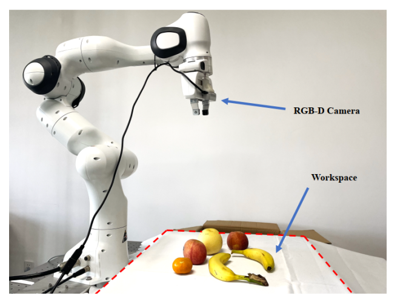
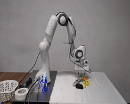
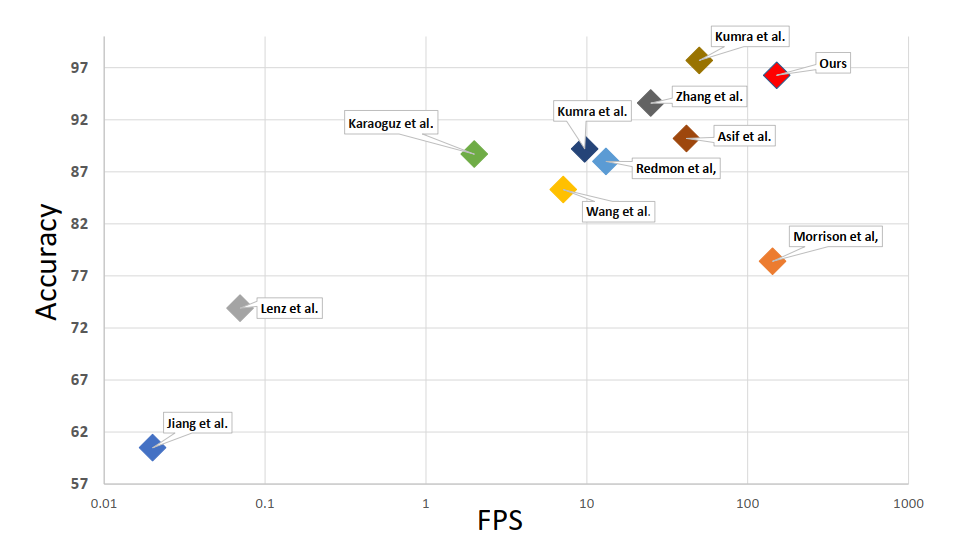
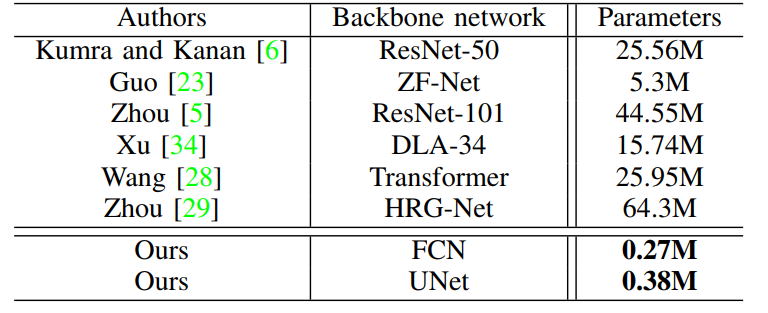
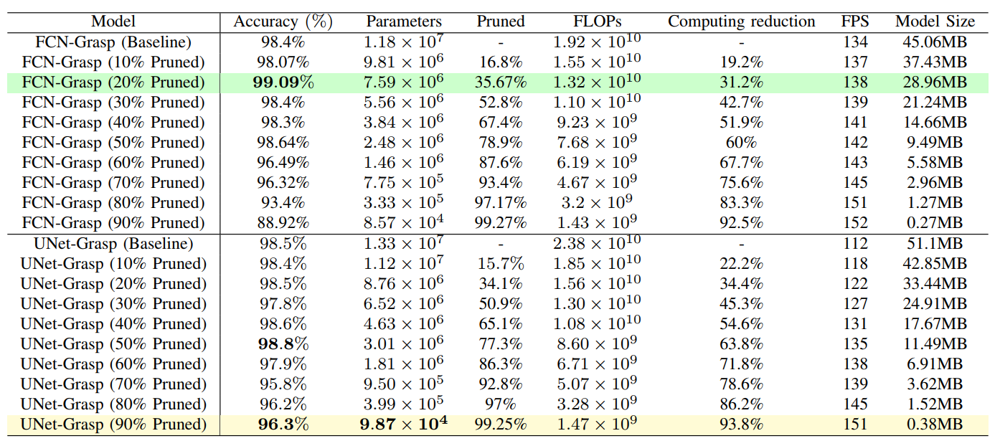
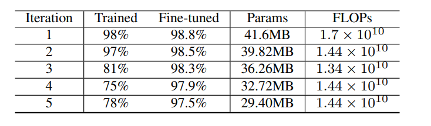
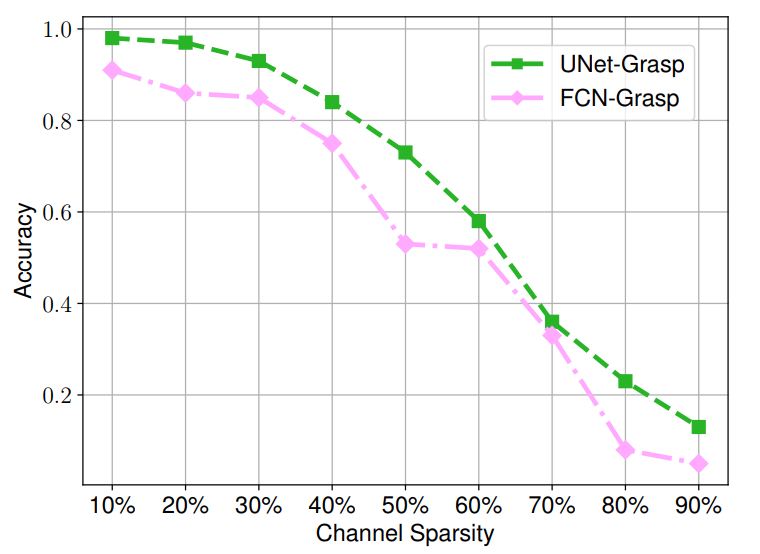
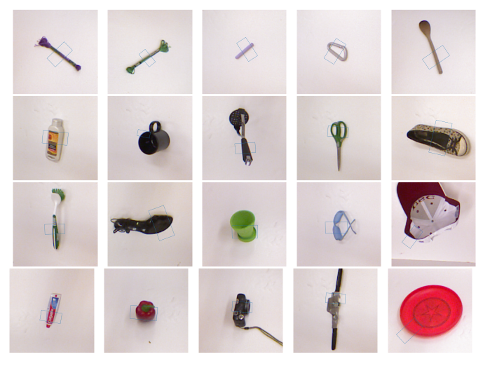

# Supplementary material of EffiGrasp: Orchestrating Precision and Nimble Mastery in Grasp Detection

### The environmental workspace for robot grasping experiments.
the better the model’s real-time and accuracy performance.

### Grasping video

## Supplementary experiments

###  Accuracy and model speed.
the better the model’s real-time and accuracy performance.

The performance of SOTA methods. The nearer the top-right corner, the better the model’s real-time and accuracy performance.
###  Comparison of backbone network parameters.

### Performance of different pruning rates on the Cornell crawl dataset.

###  Performance of iterative pruning schemes.

###  The effect of pruning different channel proportions without retraining.

###  The visualization of grasp representation on Cornell dataset.

### Our code will be released after the conference.
